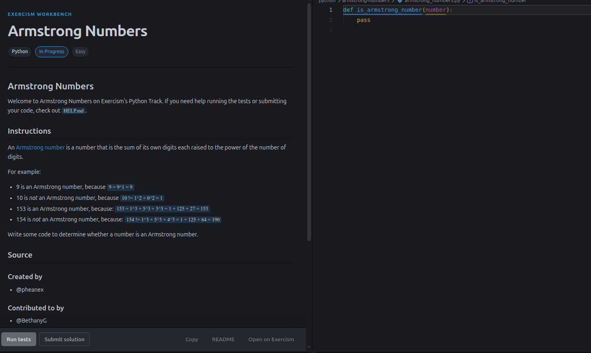

<h1 align="center">Exercism Workbench</h1>

<p align="center">
  <em>A progress-aware Exercism workspace for VS Code.</em>
</p>

<p align="center">
  <a href="LICENSE"></a>
  
  
  
</p>

<p align="center">
  <a href="#features">Features</a> &middot;
  <a href="#quick-start">Quick Start</a> &middot;
  <a href="#commands">Commands</a> &middot;
  <a href="#settings">Settings</a> &middot;
  <a href="https://exercism.org">Exercism</a>
</p>

---

## Features

- **Real Progress Sync** — Uses the API token already configured in the CLI to show joined tracks, completed work, unlocks, and the recommended next exercise
- **Sidebar Tree View** — Browse all tracks and exercises with status icons in the Activity Bar
- **Exercise Instructions** — Preview READMEs with syntax-highlighted code in a Webview panel
- **CLI Test Launcher** — Run `exercism test` from the sidebar and keep its output in VS Code
- **Test Diagnostics** — Detect incomplete downloads and common environment/setup failures, with links to exercise or track help
- **Solution Submission** — Submit solutions and auto-refresh progress
- **Download Exercises** — Browse the full exercise catalog, download with one click
- **Layout Toggle** — Swap reader/editor position (left/right) to match your preference
- **Sort Exercises** — Sort by learning path, reversed, easy-to-hard, or hard-to-easy
- **Editor-friendly Instructions** — Copy the Markdown or open `README.md` as a normal editor tab
- **Theme-aware UI** — Webview adapts to light, dark, and high-contrast themes

<p align="center">
  
</p>

### Exercise statuses

| Status | Sidebar appearance | Meaning |
|--------|--------------------|---------|
| Recommended | Yellow star | Next exercise in your learning path |
| Completed | Green pass mark | Completed or published on Exercism |
| In progress | Blue edit mark | Started online or downloaded locally |
| Available | Open circle | Unlocked and ready to start |
| Locked | Lock | Complete prerequisites first |

## Quick Start

1. **Install the [Exercism CLI](https://exercism.org/docs/using/solving-exercises/working-locally)** (v3.3.0+)
2. **Configure your API token:**
   ```bash
   exercism configure --token=<your-token>
   ```
   Get your token at [exercism.org/settings/api_cli](https://exercism.org/settings/api_cli)
3. **Open the Exercism sidebar** — click the Exercism icon in the Activity Bar
4. **Click Configure** if prompted, or exercises will load automatically
5. **Click any exercise** — code opens on one side, instructions on the other

### Sync your real web progress

Run **Exercism Workbench: Sync Progress** from the Command Palette or click the sync icon in the Exercism sidebar. The extension uses your existing CLI API token with Exercism's dedicated API host to retrieve joined tracks, unlocks, recommendations, and solutions automatically.

Progress also refreshes silently when the Exercism sidebar becomes visible or VS Code regains focus, such as after completing an exercise in the browser.

Submitting sends a new iteration through the official CLI. Exercism decides when an exercise is complete; after you complete it on the website, returning to VS Code triggers a fresh progress sync.

No browser, browser add-on, userscript, cookie export, or downloaded file is required. The older clipboard and file import commands remain available as fallbacks.

## Commands

| Command | Description |
|---------|-------------|
| `Exercism Workbench: Configure` | Set up the CLI token with a guided flow |
| `Exercism Workbench: Download Exercise` | Browse and download from the exercise catalog |
| `Exercism Workbench: Sync Progress` | Retrieve joined tracks, recommendations, unlocks, and solution progress |
| `Exercism Workbench: Sync Progress using Clipboard` | Browser-copy fallback when automatic API synchronization is unavailable |
| `Exercism Workbench: Import Progress from Clipboard` | Import a copied tracks, exercises, solutions, or combined response |
| `Exercism Workbench: Import Progress File` | Import a combined progress JSON file |
| `Exercism Workbench: Run Tests` | Run the current exercise's tests |
| `Exercism Workbench: Submit Solution` | Submit a solution or new iteration |
| `Exercism Workbench: Toggle Reader Position` | Swap reader/editor layout |
| `Exercism Workbench: Toggle Sort Order` | Cycle path, reversed, easy, and hard ordering |
| `Exercism Workbench: Open in Browser` | Open the exercise on exercism.org |
| `Exercism Workbench: Refresh` | Refresh the local workspace and visible progress |

## Settings

| Setting | Default | Description |
|---------|---------|-------------|
| `exercismWorkbench.workspacePath` | `""` | Custom workspace path. Empty means auto-detect from the CLI. |
| `exercismWorkbench.cliPath` | `"exercism"` | Exercism CLI command or absolute path. |
| `exercismWorkbench.cliTimeout` | `60000` | CLI timeout in milliseconds. |
| `exercismWorkbench.readerPosition` | `"left"` | Put the instruction reader on the left or right. |
| `exercismWorkbench.syncMode` | `"onFocus"` | Sync automatically on focus/sidebar visibility, or only manually. |
| `exercismWorkbench.syncIntervalMinutes` | `5` | Minimum delay between automatic syncs. Manual sync is never throttled. |

## Troubleshooting

- If an exercise folder exists but its download is incomplete, open it from the sidebar and choose **Repair Download**. The extension detects both missing solution files and metadata-only folders where `.exercism/config.json` was never downloaded.
- If the CLI is outside VS Code's `PATH`, set `exercismWorkbench.cliPath` to its absolute path.
- If web progress looks stale, run **Exercism Workbench: Sync Progress**. Manual synchronization is never throttled.
- Select **Exercism Workbench** in VS Code's Output panel when diagnosing tests or submissions.

The official CLI remains the primary test runner. When it cannot start, Workbench attempts to distinguish setup/toolchain problems from normal compiler or assertion failures. Recovery is based on detected project capabilities such as `CMakeLists.txt`, rather than a fixed list of language tracks. System compilers and runtimes are never installed or upgraded without your involvement.

## Architecture

```
src/
├── cli/exercismCli.ts        # CLI wrapper + Exercism API client with caching
├── workspace/workspaceScanner.ts  # Local filesystem scanner
├── models/                   # Track, Exercise, ExerciseStatus
├── views/                    # TreeView provider + items
├── webview/                  # Markdown preview panel
└── extension.ts              # Entry point, command registration
```

## Development

```bash
# Install the exact dependency set
npm ci

# Compile
npm run compile

# Watch mode
npm run watch

# Run lint, types, tests, build, and the production audit
npm run verify

# Launch in VS Code (F5)
# Uses .vscode/launch.json
```

## Contributing

See [CONTRIBUTING.md](CONTRIBUTING.md). Bug reports and focused pull requests are welcome.

## Privacy and network access

The extension reads the token saved by the official Exercism CLI and sends it only to `api.exercism.org`. It does not collect analytics or send the token to the extension author. See [PRIVACY.md](PRIVACY.md) for details.

## Track verification

- [x] **Python** — browsing, download, reader/editor layout, tests, submission,
  and progress synchronization verified end to end
- [ ] **C++** — experimental; local testing depends on the platform's compiler,
  CMake generator, and build environment
- [ ] **Rust** — experimental; current exercises may require a newer Rust
  toolchain than the operating system provides
- [ ] **Other tracks** — common Exercism operations are expected to work, but
  complete language-specific testing has not yet been verified

Workbench reports detected setup problems and may initialize a recognized build
system such as CMake. It does not install or manage language toolchains.

## Acknowledgments

Exercism Workbench was originally derived from the MIT-licensed [vscode-exercism-helper](https://github.com/skyswordw/vscode-exercism-helper) project by skyswordw. This project substantially expands its progress synchronization, status handling, notification lifecycle, testing, security, interface, and documentation while preserving the original copyright notice.

Exercism is a separate project and this community extension is not an official Exercism product. See [NOTICE.md](NOTICE.md) for attribution details.

## License

[MIT](LICENSE)

---

<p align="center">
  Built for the <a href="https://exercism.org">Exercism</a> community
</p>
