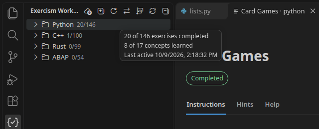
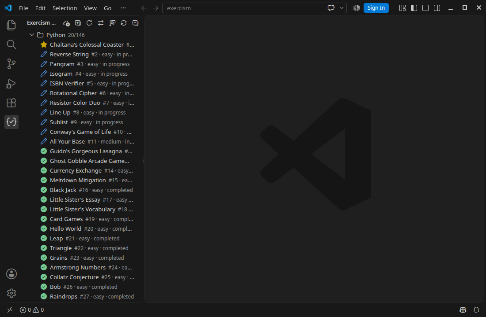

<p align="center">
  
</p>

<h1 align="center">Exercism Workbench</h1>

<p align="center">
  Work through <a href="https://exercism.org">Exercism</a> exercises without leaving VS Code:<br>
  read the instructions, run the tests, submit, and track your progress in one place.
</p>

<p align="center">
  <a href="LICENSE"></a>
  
  
</p>

<p align="center">
  
</p>

## What it does

**Your tracks, in the order you use them.** The sidebar lists every track you have joined or downloaded. The one you worked on last sits at the top, based on your latest activity on Exercism and the last time you saved a solution. Each track shows how many exercises you have completed, and its tooltip shows concepts learned and when you were last active.

<p align="center">
  
</p>

**Exercises with their real status.** Inside a track, exercises follow Exercism's learning path and show whether they are recommended, locked, available, in progress, submitted or completed. Click one to open it, or download it first if it is not on disk yet.

**Instructions beside the code.** The instructions open in a panel next to your solution, with Hints and Help in their own tabs. Code samples follow your color theme, and the tables and diagrams some exercises use render as they do on the website.

**Test, submit, complete.** The buttons under the instructions run the tests, submit, and mark the exercise as complete, so the whole loop happens in VS Code:

<p align="center">
  
</p>

- **Run tests** runs `exercism test` and keeps the output in VS Code. When tests cannot run because of the setup rather than your code, for example a missing compiler or an outdated toolchain, it says so and links to the track's setup guide. C++ exercises are configured and built with CMake when needed.
- **Submit** sends a new iteration through the CLI. If VS Code reports errors or warnings in your solution, Workbench lists them first and asks before submitting, since Exercism's analyzer will flag them too. When a submit fails, the message gives the reason, such as "nothing changed since your last iteration."
- **Mark as complete** finishes the exercise on Exercism after you confirm. The CLI has no command for this; Workbench calls the same endpoint as the website's button.

**Progress that keeps itself up to date.** Workbench reads your progress from Exercism with the token the CLI already has, and refreshes it when you return to VS Code, after you submit, or when you ask.

**Downloads that repair themselves.** If an exercise folder is missing files listed in its `.exercism/config.json`, such as a deleted test file, Workbench offers to download them again. Your solution code is kept.

## Getting started

1. Install the [Exercism CLI](https://exercism.org/docs/using/solving-exercises/working-locally) and the tools for the tracks you study, for example Python with pytest.
2. Install Exercism Workbench and open the Exercism view in the Activity Bar.
3. Click **Configure Exercism** and paste the token from [exercism.org/settings/api_cli](https://exercism.org/settings/api_cli). If the CLI is already configured, Workbench uses that token and skips this step.
4. Click an exercise to open it, or use **Download Exercise** in the view's title bar to pick a new one.

## Commands

All commands are in the Command Palette under **Exercism Workbench**. Most also appear in the sidebar and the instructions panel.

| Command | What it does |
|---------|--------------|
| Configure | Save your Exercism API token in the CLI. |
| Download Exercise | Pick a track and an exercise, then download it. |
| View Instructions | Open the current exercise's instructions next to its code. |
| Run Tests | Run the current exercise's tests. |
| Submit Solution / Submit New Iteration | Submit the solution files listed in `.exercism/config.json`. |
| Mark as Complete | Mark a submitted exercise as complete on Exercism. |
| Open in Browser | Open the exercise on exercism.org. |
| Sync Progress | Fetch your tracks, unlocks and solution statuses now. |
| Sync Progress using Clipboard | Fallback if Exercism blocks API requests: copy each JSON page from the browser. |
| Import Progress from Clipboard / File | Load progress JSON you saved yourself. |
| Toggle Reader Position | Swap the instructions and code columns. |
| Toggle Sort Order | Order exercises by learning path, reversed, easy to hard, or hard to easy. |
| Expand All | Expand or collapse every track. |
| Refresh | Reload the sidebar. |

## Settings

| Setting | Default | Description |
|---------|---------|-------------|
| `exercismWorkbench.workspacePath` | `""` | Exercism folder to use. Empty means the CLI's workspace, then `~/exercism`. |
| `exercismWorkbench.cliPath` | `"exercism"` | CLI command, or its full path if it is not on VS Code's `PATH`. |
| `exercismWorkbench.cliTimeout` | `60000` | Time limit for CLI commands and web requests, in milliseconds. |
| `exercismWorkbench.readerPosition` | `"left"` | Which side the instructions open on. |
| `exercismWorkbench.syncMode` | `"onFocus"` | Sync when VS Code or the sidebar regains focus, or only when you ask. |
| `exercismWorkbench.syncIntervalMinutes` | `5` | Shortest time between automatic syncs. Manual sync ignores it. |

## Troubleshooting

- **"Exercism is limiting requests right now."** Exercism allows a limited number of API requests per minute. Wait a minute and try again.
- **Tests fail before running your code.** Check the **Exercism Workbench** output channel. For Python, pytest must be installed in the environment VS Code uses. Plugins from other software on the same `PYTHONPATH`, such as ROS, can break pytest before it starts.
- **The CLI is not found.** Set `exercismWorkbench.cliPath` to the full path of the `exercism` program.
- **The sidebar looks out of date.** Run **Sync Progress**, which is never throttled.

## Track support

| Track | Status |
|-------|--------|
| Python | Download, instructions, tests, submit, complete and sync tested end to end. |
| C++ | Expected to work; needs CMake and a C++ compiler. Not yet tested end to end. |
| Rust | Expected to work; some exercises need a recent Rust toolchain. Not yet tested end to end. |
| Other tracks | Expected to work, since everything goes through the official CLI, but not tested track by track. |

Workbench never installs or updates language toolchains. It only reports what is missing.

## Privacy

Workbench has no analytics or telemetry. It sends your Exercism token only to `api.exercism.org`, and only for your own progress and solutions. See [PRIVACY.md](PRIVACY.md).

## Development

Requires Node.js 22 or newer and the Exercism CLI.

```bash
npm ci            # install dependencies
npm run watch     # rebuild on change; press F5 in VS Code to try it
npm run verify    # lint, type check, tests, build and dependency audit
npx vsce package  # build a .vsix
```

```
src/
├── extension.ts      Activation: creates the services and registers commands
├── workbench.ts      Shared services, progress storage and background sync
├── commands/         One file per group of commands
├── exercises/        Finding, opening and repairing exercises
├── cli/              Running the Exercism CLI and reading its output
├── api/              Exercism's web API
├── progress/         Parsing and storing progress
├── views/            Sidebar tree, ordering and items
├── webview/          Instructions panel and Markdown rendering
└── workspace/        Scanning the Exercism folder on disk
webview-ui/           Panel stylesheet and script
```

See [CONTRIBUTING.md](CONTRIBUTING.md) before opening a pull request.

## Origin

Exercism Workbench started from [vscode-exercism-helper](https://github.com/skyswordw/vscode-exercism-helper) by skyswordw. That project supplied the original idea of a sidebar and instructions panel for Exercism, but it did not work in practice. Workbench rebuilt it from that starting point with new code, adding progress sync, submission and completion, test diagnostics, download repair and the current interface.

## License

[MIT](LICENSE). Exercism Workbench is a community project and is not affiliated with or endorsed by Exercism. See [NOTICE.md](NOTICE.md).
